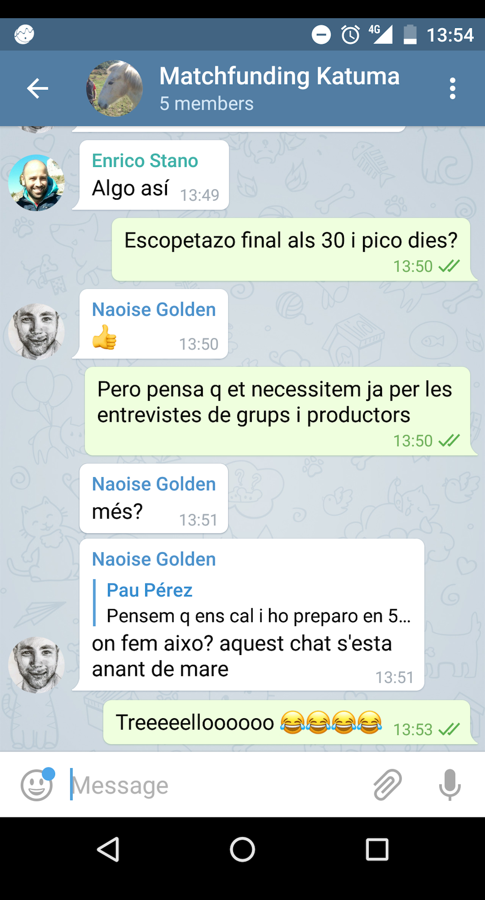

# Construint comunitats acollidores

---

## Coopdevs

Pau Pérez

* a [Coopdevs](http://coopdevs.org/)

[github.com/coopdevs](https://github.com/coopdevs)
[community.coopdevs.org](http://community.coopdevs.org/)

---

## Sistemes de control de versions

Reusem i desenvolupem codi de manera col·laborativa

---

## Git

Sistema distribuït de control de versions

* Commits
* Branques
* Repositoris

---

## Social coding

El treball en comunitat que es construeix sobre el software

---

## Git*

Plataforma de desenvolupament software

* Allotjament de repositoris
* Revisió del codi
* Gestió del projecte
* *Social coding*
* Llicència*

---

## GitLab

* Allotjament de repositoris
* Revisió del codi
* Gestió del projecte
* *Social coding*
* *Codi Obert*

---

## Humans

El problema són els humans
comunicació

---

Ens costa comunicar idees abstractes

---

Ens costa estructura idees

---

### Sentiments

Els humans tenen sentiments

---

### Sentiments

També tenen estat d'ànim

---

### Sentiments

Donar les gràcies

---

## Simbiosi

Contribuïdor dóna
  * aprèn (majoria de casos)
  * se sent realitzat

Projecte avança feina

---

## Organització

Mantenir llistat d'issues *perfectament* detallats

---

## Organització

Hi ha tasques més enllà del software

---

## Organització

Tingues una vista d'ocell amb una eina de gestió de projectes

---

## Processos

Fes les coses aburrides i repetitives

---

## Processos

Llavors, automatitza. No abans*

---

## Documentació

Objectiu: que el projecte segueixi tot i que tu tinguis amnèsia

---

## Documentació

* No ho recordem tot
* Més gent si ha de poder sumar

---

## Code Review

Acompanyar, tenint en compte que molta gent ve a aprendre i ho fan al temps lliure.

---

## Testing

---

## Sales pitch

Ajudeu-nos a traduir [opensource.guide](www.opensource.guide)
